# 全美第一辩手蔡子豪

---

## 关于精神美利坚人的47分钟回应视频

在openexpo源码公开后，美利坚著名留学生、时薪17刀的2美元收藏大师、前德州披风诈骗犯先锋、现expo商业帝国唯一法定继承人、java之子**蔡子豪**，特意录制了一期长达 **47 分钟 00 秒** 的狡辩视频。

   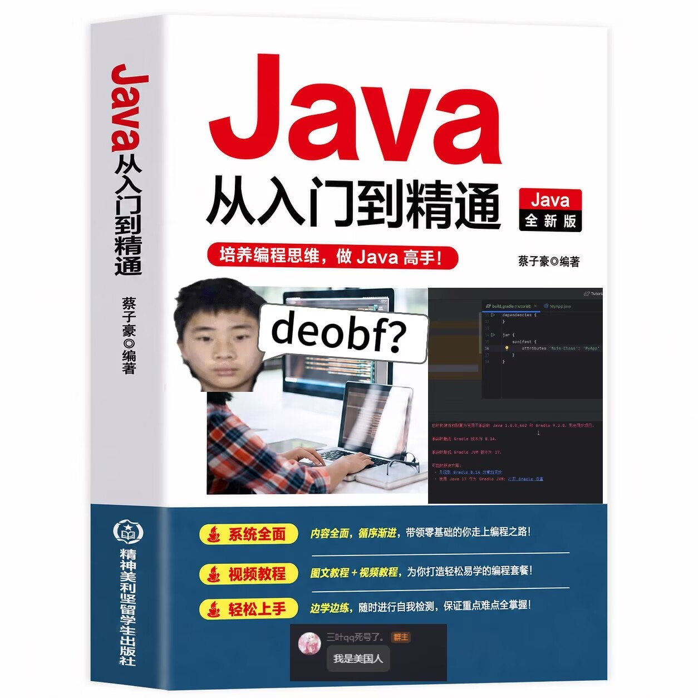

原本我们以为蔡子豪能掏出源码和绕过思路以及各种证据来狗叫我们；结果整整47分钟，蔡子豪除了对着readme里抄袭**openmyau**无能狂怒将近10分钟、说了68次“美国”之外，就是**把README里的每一句话都互相佐证了**。

为README中描述他的病情提供了临床样本

   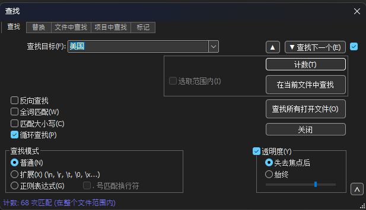

蔡子豪以为发完视频有人能可怜他，结果发现评论区下都是骂他的：

   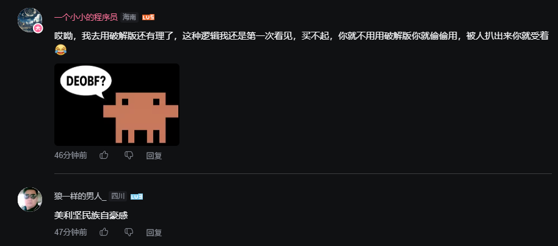
   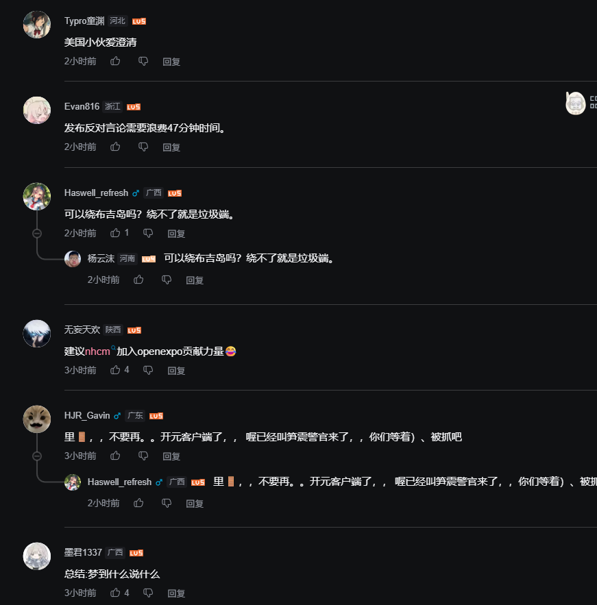

---

## 被说抄袭蔡子豪就这样狡辩

1. **正在skid raven clickgui的蔡子豪**：
   > *“我当时确实是把那个raven的clickgui拿来用了，因为我真的自己懒得写那个gui，但是又怎么样？”* （03:34）
   

      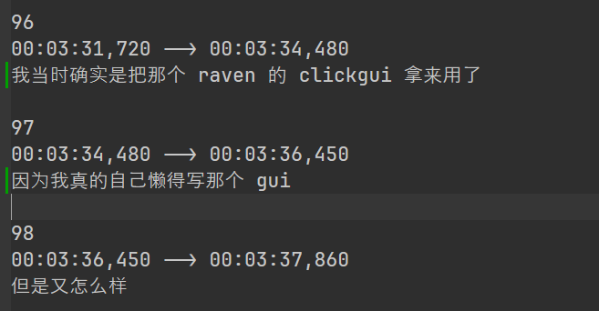
   

2. **方块人外挂之商业软件**：
   > *“expo是商业软件啊”* （05:39）
   

      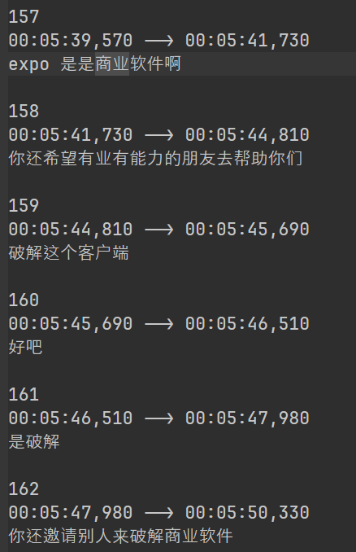
   

3. **只要我嘴硬那我就是没抄**：
   > *“我很不喜欢这种扣帽子的说法啊 基于openmyau和ranven缝合的”* （00:31）
   

      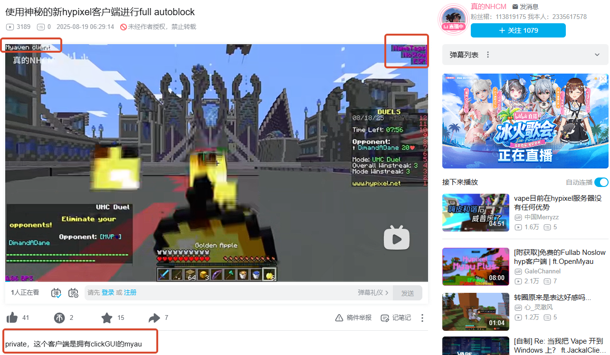
   

   

      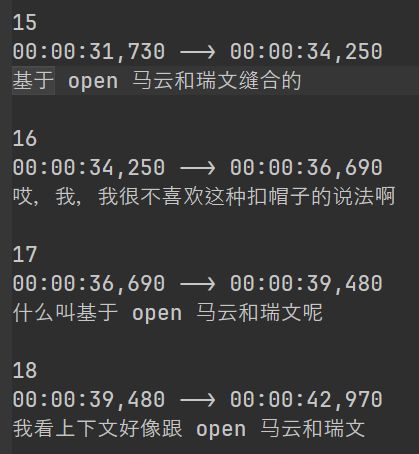
      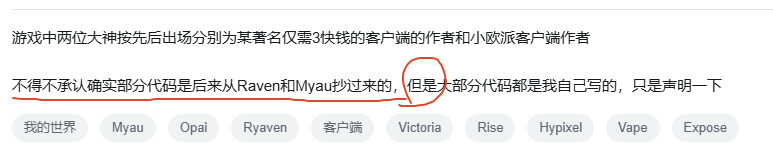
      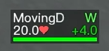
   

   

      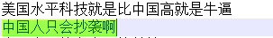
      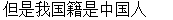
   

只要蔡子豪嘴硬说："长得又不代表我是抄他的，你拿早期视频怎么证明我的base就是myau"。那就是没抄。

---

## 蔡子豪之看不起穷逼

### 身为在最低时薪17美刀国家的蔡子豪正在看不起穷逼：

   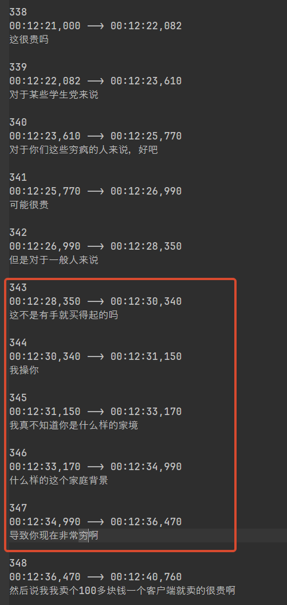

很明显蔡子豪认为我们是穷逼且并不清楚开源他客户端所消耗的claude™ token费用，以及支付了多少usd。并发表以下言论：

   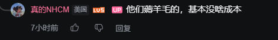

#### 以下为claude直连api计费账单(非订阅非api中转):

值得注意 claude的api计费是直接扣除余额的。为什么要用api，因为claude封号问题严重我们懒得处理开发环境，故使用api。

   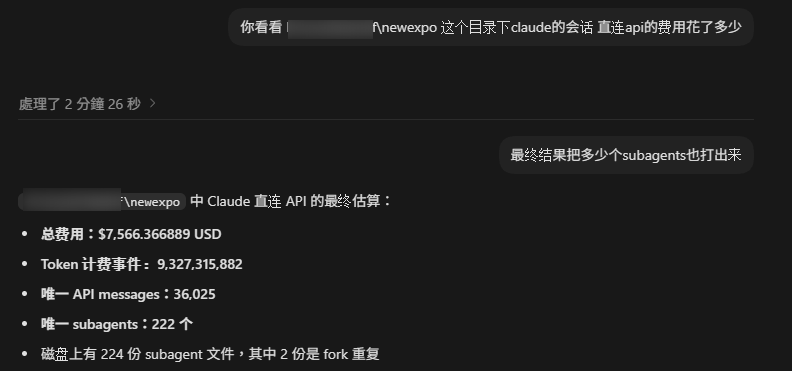
   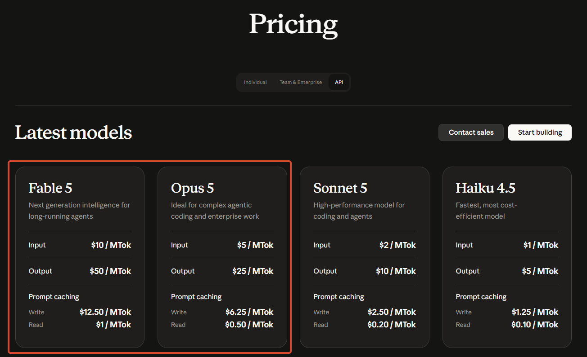

希望蔡子豪可以帮我找到一个免费使用7500usd的claude api过来给我们用。

### 真正在薅羊毛的人：

   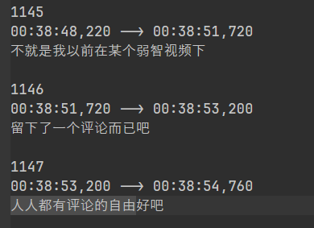
   

薅羊毛什么时候算评论了

---

## 蔡子豪对于自己的技术非常自信

   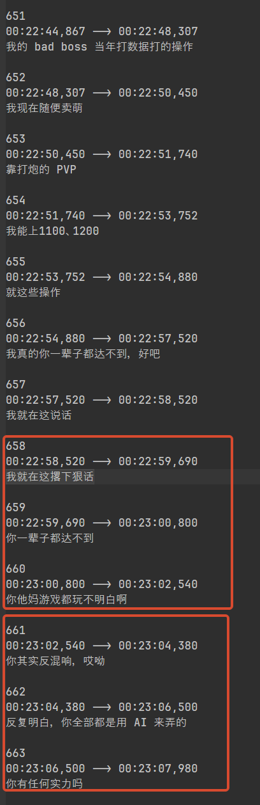

希望蔡子豪有一日可以用ai手撕vmp、tmd，达到我们的水平后再来和我们相提并论。

如果你的ai解不出来，那你纯属废物^^

依旧想当年超强方块人技术力。

---

## 使用破解软件的蔡子豪就这样狡辩

面对使用破解版的vmp、zkm、jnic，蔡子豪的大脑在经过0.1秒的思考后得出了以下傻逼言论 (04:33)：
> *“300 欧我才不用，我才不想花 300 欧去买一个已经可以破解的保护软件……明明有破解我不去用，说的像是我道德有问题一样”*

   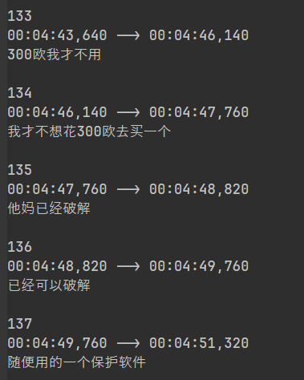

时薪17刀买不起正版保护软件的蔡子豪：

   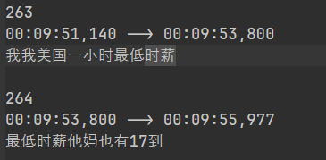

对此笔者十分理解精神美利坚贫困留学生的家庭窘境，找人巴结一份破解版的保护软件非常不容易。

---

## 蔡子豪诈骗犯自传

### 蔡子豪之我诈骗是对的
> *“兄弟，我曾经确实诈骗过……群友给我打了钱让我去弄激活码，我当时脑残，给他激活码全部兑换了导致别人血本无归……那应该是我早年赚的**第一桶金**。”*

蔡子豪之诈骗犯的第一桶金。

### 蔡子豪之左脑攻击右脑
* **13:00**：“我倒卖麦控？我倒卖过！”
* **14:33**：“兄弟，我早年我就没有倒卖过麦控！”
* **15:33**：“我确实倒卖过，买了 JSYZ 一个诈骗号怕被锁，赶快半价卖给别人了……” (依旧举一反三)
* **46:31**：“首先我从来没有倒卖过 MC！我从来没有诈骗过 minecon！”

   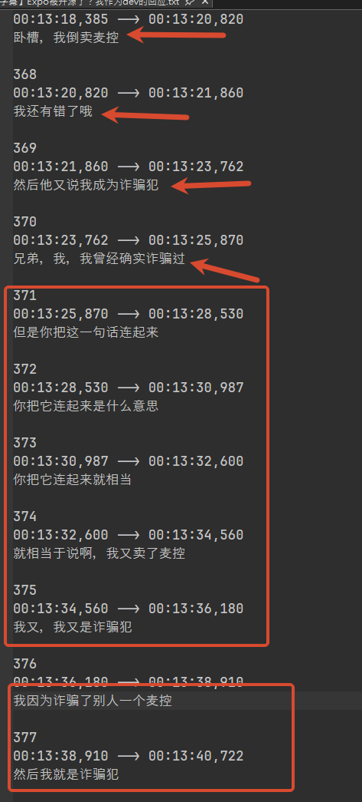

蔡子豪：我只诈骗了一个minecon，所以我不算诈骗犯。

---

## 蔡子豪之我是美国人我自豪

### 为了自证自己在美国赚的钱比中国多，蔡子豪用其大脑不正常的脑回路发表以下言论：

   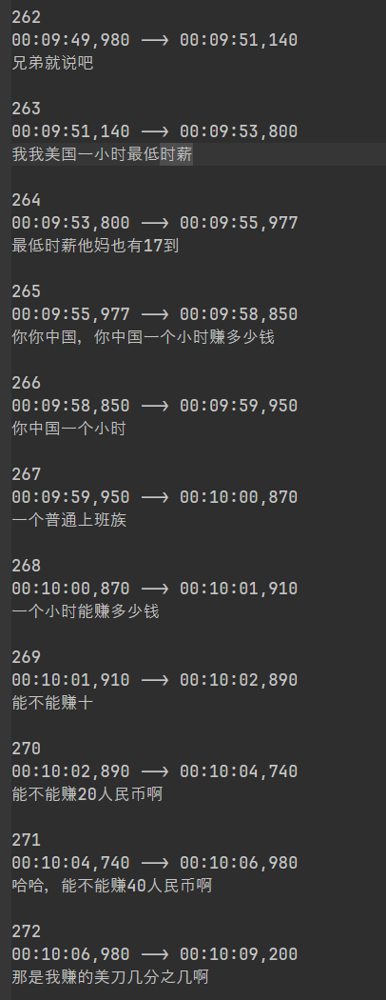

### 怎么洗清自己在装逼的事实:

   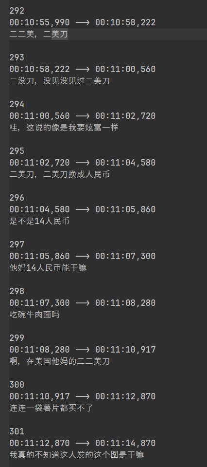
   

蔡子豪："见没见过两美刀"

### 从墨西哥偷渡到美国到拿到美国绿卡

   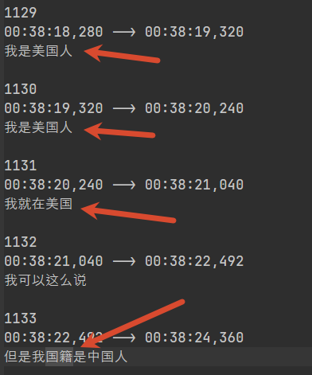

### 怎么狡辩当时在崇洋媚外的事实

   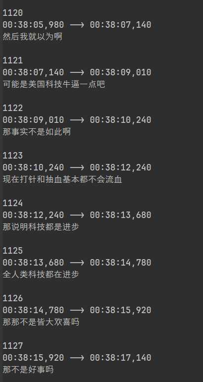

蔡子豪："只要我改口科技在进步，我就可以颠倒黑白"

### 美国就是好就是牛逼我要一辈子待在美国

   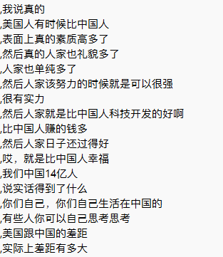

蔡子豪已领取到美国绿卡，申请注销中国户籍。

### 蔡子豪之成为美国人但是英语不好

   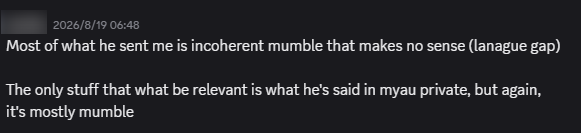

来自某位外国友人对应蔡子豪的评价

---

## 蔡子豪的文字狱

   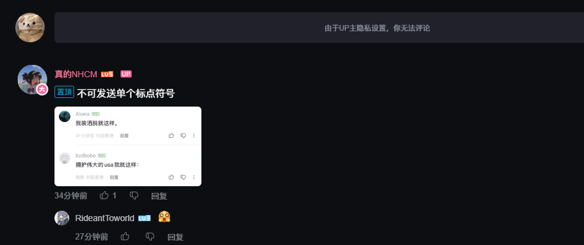

原评论是将蔡子豪视频中的字幕提取出来成图片，然后发在评论区。

很明显你在他的视频底下无法看到关于任何说expo客户端的坏的负面消息。一旦你辱骂了他的客户端和美国将会立即把你拉黑。
